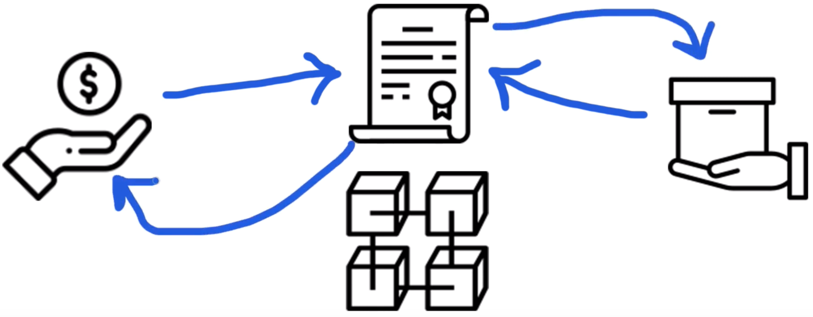

# Onion Marketplace

`Onion Marketplace` este un magazin online care ruleaza folosind un blockchain. 
Acest magazin permite utilizatorilor sa vanda sau sa cumpere lucruri prin 
intermediul criptomonedei Ether.



## Ce este un blockchain?

Un blockchain este o retea de noduri peer-to-peer ce comunica intre ele. 
Aceste noduri sunt de fapt calculatoare care impart responsabilitati 
asemenea unor web servere, precum rularea unor programe si stocarea unor date
ce pot fi accesate oricand suntem conectati la blockchain. Toate nodurile
lucreaza impreuna pentru a crea o retea publica la care oricine se poate
conecta. Totusi, blockchain-urile lucreaza diferit fata de web servele 
traditionale. Tot codul si datele dintr-un blockchain sunt descentralizate,
sunt distribuite pe toate nodurile din retea. 

Toate datele sunt continute in pachete de inregistrari numite blocuri care 
sunt inlantuite pentru a alcatui ledger-ul public. Toate nodurile din retea 
participa la asigurarea ca datele raman securizate si neschimbate.

## Ce este un Smart Contract?

Smart contractele sunt sunt programe pe care le putem implementa intr-un 
blockchain. Sunt scrise in limbajul de programare Solidity.
Smart contractele sunt imutabile ceea ce inseamna ca o data ce au fost create,
nu mai pot fi modificate. De aceea este esential sa se realizeze o testare 
a acestora locala inainte de a fi implementate in blockchain.

In cazul nostru Smart Contract-ul `Marketplace.sol` va functiona precum o 
masina de distribuire prin distribuirea articolelor catre cumparator si prin 
transferul platii instantaneu catre vanzator.

## Dependinte

* Ganache Personal Blockchain -> Este un blockchain care ruleaza local si poate
fi folosit pentru development. 
* Node.js;
* npm;
* Truffle Framework:
    * Managementul unui Smart Contract -> scrierea unor smart contracte folosind
    Solidity si compilarea acestuia intr-un bytecode care poate fi rulat pe
    Ethereum Virtal Machine (EVM);
    * Testare automata -> scrierea unor teste pentru a valida comportamentul dorit
    pentru un Smart Contract;
    * Implementarea & Migrarea -> Scrierea unor script-uri pentru implementarea si migrarea
    unor smart contracte catre orice retea de Ethereum blockchain;
* Metamask ->  O extensie de browser care ne permite sa ne conectam catre un blockchain;

## Explicatia Smart Contract-ului Marketplace.sol

```java
pragma solidity ^0.5.0;

contract Marketplace {
    // Identificatorul name reprezinta o variabila de tip state.
    // Ce inseamna o variabila de tip state? Ei bine variabilele de tip state
    // sunt stocate si sincronizate pe intreaga retea de noduri din blockchain. 
    // Aceasta variabila va stoca numele Smart Contractului. 
    string public name; 

    // Construim o structura in Smart Contract care va stoca toate atributele
    // de care un produs are nevoie pentru a fi reprezentat in Marketplace
    struct Product {
        uint id;
        string name;
        uint price;
        address payable owner; // Deoarece vrem sa platim detinatorul bunului
                               // respectiv acest camp devine payable
        bool purchased;
    }

    // Pentru a stoca produsele in blockchain vom crea un mapping care 
    // functioneaza asemenea dictionarelor din Python. Mappings au 
    // chei unice prin care sunt returnate valori unice. In cazul
    // nostru vom folosi un id ca cheia, iar rezultatul va fi un produs
    mapping(uint => Product) public products;

    // Pentru a retine numarul de produse care exista in Smart Contract
    // adaugam o variabila productCount
    uint public productCount = 0;


    event ProductCreated(
        uint id,
        string name,
        uint price,
        address payable owner,
        bool purchased
    );

    event ProductPurchased(
        uint id,
        string name,
        uint price,
        address payable owner,
        bool purchased
    );

    // Constructorul este o functie speciala din Solidity ce este apelata
    // cand Smart Contractul este creat ( cu alte cuvinte cand acesta este 
    // implementat in Blockchain ). 
    constructor() public {
        name = "Onion Marketplace";
    }

    // Realizam o functie prin care sunt creeate produse noi
    // Aceasta functie primeste un nume de produs prin intermediul parametrului
    // name si un pret exprimat in Wei (cea mai mica subdiviziuneaa Ether-ului)
    // prin intermediul variabilei price
    function createProduct(string memory _name, uint _price) public {
        // Adaugam niste conditii ca numele si pretul sa fie niste variabile
        // valide 
        require(bytes(_name).length > 0);
        require(_price > 0);
        
        // Incrementam numarul total de produse
        productCount++;

        // Momentul in care obiectul este creat efectiv si adaugat in Mapping.
        // msg.sender este adresa utilizatorului care creeaza produsul
        products[productCount] = Product(productCount, _name, _price, msg.sender, false);
        
        // In cele din urma, facem trigger unui eveniment pentru a anunta
        // intreaga retea de noduri ca produsul a fost creat cu succes
        emit ProductCreated(productCount, _name, _price, msg.sender, false);
    }

    // Realizam o functie prin care sunt cumparate produsele. De fiecare data
    // cand cineva apeleaza aceasta functie, va subscrie id-ul produsului pe
    // care doreste sa il cumpere ( acest lucru este realizat de componenta 
    // de React din frontend). De ce am facut functia payable? Ei bine payable
    // inseamna ca va accepta Ethereum ca metoda de plata. 
    function purchaseProduct(uint _id) public payable {
        // Obtinem produsul din mapping si ii realizam o copie locala
        Product memory _product = products[_id];
        // Stocam propietarul curent intr-o variabila. In aceasta functie
        // vom transfera detinatorul produsului respectiv, deci trebuie
        // sa stim cine a fost detinatorul initial
        address payable _seller = _product.owner;
        // ne asiguram ca produsul este valid
        require(_product.id > 0 && _product.id <- productCount);
        // ne asiguram ca exista destui ether in tranzactie
        require(msg.value >= _product.price);
        // ne asiguram ca produsul nu a fost cumparat deja
        require(!_product.purchased);
        // ne asiguram ca produsul nu este cumparat tot de catre vanzator
        require(_seller != msg.sender);
        // Transferam detinatorul
        _product.owner = msg.sender;
        // marcam produsul ca fiind cumparat
        _product.purchased = true;
        // actualizam produsul in mapping
        products[_id] = _product;
        // platim vanzatorul 
        address(_seller).transfer(msg.value);
        // emitem un eveniment pentru a marca faptul ca produsul a fost 
        // cumparat cu success
        emit ProductPurchased(productCount, _product.name, _product.price, msg.sender, true);
    }
}
```

Compilarea se realizeaza folosind comanda:

```sh
truffle compile
```

Realizarea implementarii in blockchain se face prin createa unui script `2_deploy_contracts.js`.
Acest fisier ii spune lui Truffle ce smart contract sa implementeze in blockchain. 

Comanda:

```sh
truffle migrate
```

Crearea testelor este foarte importanta in Blockchain deoarece o data ce un blockchain a fost 
implementat in retea acesta nu mai poate fi schimbat:

```js
const Marketplace = artifacts.require("./Marketplace.sol");

require('chai')
  .use(require('chai-as-promised'))
  .should()


contract('Marketplace', ([deployer, seller, buyer]) => {
let marketplace

before(async () => {
    marketplace = await Marketplace.deployed()
})

describe('deployment', async () => {
    it('deploys successfully', async () => {
      const address = await marketplace.address
      assert.notEqual(address, 0x0)
      assert.notEqual(address, '')
      assert.notEqual(address, null)
      assert.notEqual(address, undefined)
    })

    it('has a name', async () => {
      const name = await marketplace.name()
      assert.equal(name, 'Onion Marketplace')
    })
})

describe('products', async () => {
    let result, productCount

    before(async () => {
      result = await marketplace.createProduct('iPhone X', web3.utils.toWei('1', 'Ether'), { from: seller })
      productCount = await marketplace.productCount()
    })

    it('creates products', async () => {
      // succes
      assert.equal(productCount, 1)
      const event = result.logs[0].args
      assert.equal(event.id.toNumber(), productCount.toNumber(), 'id is correct')
      assert.equal(event.name, 'iPhone X', 'name is correct')
      assert.equal(event.price, '1000000000000000000', 'price is correct')
      assert.equal(event.owner, seller, 'owner is correct')
      assert.equal(event.purchased, false, 'purchased is correct')

      // fail: Produsul trebuie sa aiba un nume
      await await marketplace.createProduct('', web3.utils.toWei('1', 'Ether'), { from: seller }).should.be.rejected;
      // fail: Produsul trebuie sa aiba un pret
      await await marketplace.createProduct('iPhone X', 0, { from: seller }).should.be.rejected;
    })

    it('sells products', async () => {
        let oldSellerBalance
        oldSellerBalance = await web3.eth.getBalance(seller)
        oldSellerBalance = new web3.utils.BN(oldSellerBalance)
      
        result = await marketplace.purchaseProduct(productCount, { from: buyer, value: web3.utils.toWei('1', 'Ether')})
      
        const event = result.logs[0].args
        assert.equal(event.id.toNumber(), productCount.toNumber(), 'id is correct')
        assert.equal(event.name, 'iPhone X', 'name is correct')
        assert.equal(event.price, '1000000000000000000', 'price is correct')
        assert.equal(event.owner, buyer, 'owner is correct')
        assert.equal(event.purchased, true, 'purchased is correct')
      
        let newSellerBalance
        newSellerBalance = await web3.eth.getBalance(seller)
        newSellerBalance = new web3.utils.BN(newSellerBalance)
      
        let price
        price = web3.utils.toWei('1', 'Ether')
        price = new web3.utils.BN(price)
      
        const exepectedBalance = oldSellerBalance.add(price)
      
        assert.equal(newSellerBalance.toString(), exepectedBalance.toString())
      
        // fail: Incearca sa se cumpere un produs care nu exista, nu are un id valid;
        await marketplace.purchaseProduct(99, { from: buyer, value: web3.utils.toWei('1', 'Ether')}).should.be.rejected;
        // fail: Cumparatorul incearca sa cumpere neavand fonduri suficiente
        await marketplace.purchaseProduct(productCount, { from: buyer, value: web3.utils.toWei('0.5', 'Ether') }).should.be.rejected;
        // fail: Cumparatorul nu poate fi vanzatorul
        await marketplace.purchaseProduct(productCount, { from: buyer, value: web3.utils.toWei('1', 'Ether') }).should.be.rejected;
      })
  })
})
```

### Partea de frontend

In partea de Frontend am folosit:
* React.js pentru a construi interfata;
* Bootstrap tot pentru interfata;
* Web3.js pentru a conecta aplicatia la blockchain.

Pentru a conecta browserul la blockchain am folosit Metamask. Apoi pentru a 
mima interactiunea dintre un vanzator si un cumparator adaugam doua conturi.

```js
import React, { Component } from 'react';
import './App.css';
import Web3 from 'web3'
import Navbar from './Navbar'
import Marketplace from '../abis/Marketplace.json'
import Main from './Main'

class App extends Component {
  constructor(props) {
    super(props)
    this.state = {
      account: '',
      productCount: 0,
      products: [],
      loading: true
    }
    this.createProduct = this.createProduct.bind(this)
    this.purchaseProduct = this.purchaseProduct.bind(this)
  }

  async componentWillMount() {
    // Incarcam web3
    await this.loadWeb3()
    await this.loadBlockchainData()
  }

  // Functia detecteaza prezenta unui furnizor de Ethereum in webbrowser
  // care ne permite conectarea la un blockchain.
  async loadWeb3() {
    if (window.ethereum) {
      window.web3 = new Web3(window.ethereum)
      await window.ethereum.enable()
    }
    else if (window.web3) {
      window.web3 = new Web3(window.web3.currentProvider)
    }
    else {
      window.alert('Non-Ethereum browser detected. You should consider trying MetaMask!')
    }
  }

  async loadBlockchainData() {
    const web3 = window.web3
    // incarca conturile din blockchain in memorie
    const accounts = await web3.eth.getAccounts()
    this.setState({ account: accounts[0] })
    const networkId = await web3.eth.net.getId()
    const networkData = Marketplace.networks[networkId]
    if (networkData) {
      const marketplace = web3.eth.Contract(Marketplace.abi, networkData.address)
      this.setState({ marketplace })
      const productCount = await marketplace.methods.productCount().call()
      this.setState({ loading: false })
      this.setState({ productCount })
      // incarca produsele din blockchain
      for (var i = 1; i <= productCount; i++) {
        const product = await marketplace.methods.products(i).call()
        this.setState({
          products: [...this.state.products, product]
        })
      }
    } else {
      window.alert('Marketplace contract not deployed to detected network.')
    }
  }

  // Functiile care apeleaza Smart Contractul pentru a crea si a vinde produsele
  createProduct(name, price) {
    this.setState({ loading: true })
    this.state.marketplace.methods.createProduct(name, price).send({ from: this.state.account })
    .once('receipt', (receipt) => {
      this.setState({ loading: false })
    })
  }

  purchaseProduct(id, price) {
    this.setState({ loading: true })
    this.state.marketplace.methods.purchaseProduct(id).send({ from: this.state.account, value: price })
    .once('receipt', (receipt) => {
      this.setState({ loading: false })
    })
  }
  
  render() {
    return (
      <div>
        <Navbar account={this.state.account} />
        <div className="container-fluid mt-5">
          <div className="row">
            <main role="main" className="col-lg-12 d-flex">
              {this.state.loading
                ? <div id="loader" className="text-center"><p className="text-center">Loading...</p></div>
                : <Main
                  products={this.state.products}
                  createProduct={this.createProduct}
                  purchaseProduct={this.purchaseProduct} />
              }
            </main>
          </div>
        </div>
      </div>
    );
  }
}

export default App;
```
